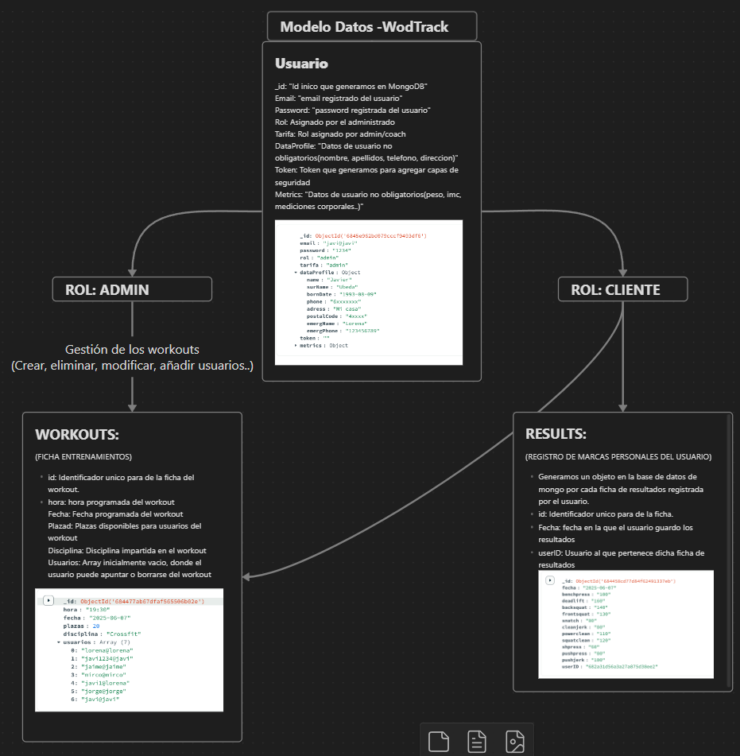

# Nombre del Proyecto - WodTrack:

## Descripción detallada

Esta aplicación web está diseñada para la gestión integral de un centro de entrenamiento deportivo, combinando funcionalidades para administradores, coaches y usuarios finales con roles y permisos diferenciados.

### Gestión administrativa y de coaches

- **Administrador:** Tiene acceso completo a la plataforma para gestionar usuarios, coaches, tarifas, permisos y entrenamientos. Puede crear, editar y eliminar usuarios y coaches, asignarles roles y controlar su acceso a las diferentes funcionalidades del sistema. Administra la configuración general del centro, las tarifas y las políticas internas.
- **Coach:** Usuarios con rol coach que gestionan directamente los entrenamientos. Pueden crear y modificar sesiones de entrenamiento (workouts), controlar plazas disponibles para cada clase y hacer seguimiento del progreso de los usuarios asignados. Los coaches también gestionan las métricas corporales y las marcas personales de los usuarios, aportando un seguimiento detallado para mejorar el rendimiento.

### Funcionalidades para usuarios

Los usuarios finales tienen acceso a funcionalidades orientadas a su experiencia y progreso personal:

- Consulta y control de las clases reservadas y asistencia.
- Registro y visualización de resultados personales y métricas corporales (peso, porcentaje de grasa, medidas, etc.).
- Seguimiento evolutivo de sus marcas personales y rendimiento en diferentes entrenamientos.
- Visualización de estadísticas y progreso a lo largo del tiempo para facilitar el seguimineto.

## Control de accesos y sesiones

- La plataforma implementa un sistema de control de accesos basado en roles, asegurando que cada usuario solo pueda acceder a las funcionalidades correspondientes a su perfil: administrador, coach o usuario.
- El login exitoso genera una sesión de usuario que se almacena en el navegador mediante `sessionStorage`, guardando únicamente los datos esenciales (como el `_id` y el rol).
- Cada vista de la aplicación valida si hay una sesión activa y si el usuario tiene permiso para acceder al contenido. Si no se detecta sesión o el rol es incorrecto, se redirige automáticamente a la pantalla de login.
- Este sistema permite proteger tanto las rutas del frontend como las del backend, evitando accesos no autorizados o manipulaciones manuales desde el cliente.

---

## Tecnologías utilizadas

- **Backend:** Node.js con Express para el desarrollo de la API RESTful.
- **Base de datos:** MongoDB con conexión nativa.
- **Frontend:** HTML, CSS , JavaScript y Web Components Lit
- **Sesiones:** Gestión de sesión de usuario con `sessionStorage` en el navegador para almacenar datos mínimos de autenticación.
- **Middleware:** Uso de `body-parser` para el procesamiento y validación de datos enviados desde el cliente.

---

## Gestión de datos y seguridad

- La aplicación controla estrictamente los roles y permisos para garantizar que cada usuario accede solo a las funcionalidades autorizadas según su perfil (administrador, coach o usuario).
- Los datos de usuarios, entrenamientos y resultados se almacenan y gestionan en MongoDB, con consultas y modificaciones hechas directamente en el backend para asegurar integridad.
- Se implementan validaciones tanto en frontend como en backend para prevenir errores y garantizar la seguridad.
- El backend protege las rutas mediante validación de sesión y tokenización para evitar accesos no autorizados.

- Proyecto Final BootCamp Neoland 2025.
- Javier Ubeda Hurtado